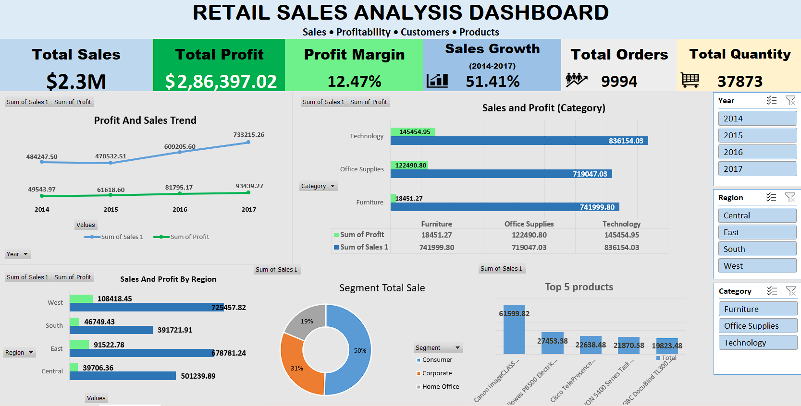

# 📊 Retail Sales Analysis Dashboard — Excel

An interactive **Retail Sales Analysis Dashboard built in Microsoft Excel** to analyze sales performance, profitability, customer segments, products, regions, and discount impact.

This project demonstrates practical **Data Analyst skills in Excel**, including data cleaning, analysis, PivotTables, PivotCharts, KPI development, and business-focused dashboard design.

---

## 🎯 Project Overview

The objective of this project is to analyze retail sales data and provide actionable business insights that can support:

* Sales performance monitoring
* Profitability analysis
* Product and category performance
* Regional performance comparison
* Customer segment analysis
* Discount strategy evaluation
* Identification of loss-making products/categories
* Business decision-making

---

## 🏢 Business Problem

A retail company wants to understand:

1. How are sales and profit changing over time?
2. Which categories and regions generate the most revenue and profit?
3. Which customer segments contribute the most sales?
4. Which products and states perform best?
5. How do discounts affect profitability?
6. Which sub-categories are generating losses?
7. Where are opportunities to improve business performance?

This dashboard provides a visual and interactive way to answer these questions.

---

## 🛠️ Tools & Skills Used

### Tools

* **Microsoft Excel**
* PivotTables
* PivotCharts
* Excel formulas
* Slicers
* Conditional formatting
* Data cleaning
* Data analysis
* Dashboard design

### Analytical Skills

* KPI analysis
* Trend analysis
* Profitability analysis
* Customer segmentation
* Product performance analysis
* Regional analysis
* Discount analysis
* Business insight generation

---

## 📁 Dataset

The dataset contains approximately **9,994 retail sales records** with information about:

| Field         | Description                |
| ------------- | -------------------------- |
| Order ID      | Unique order identifier    |
| Order Date    | Date when order was placed |
| Ship Date     | Shipping date              |
| Ship Mode     | Shipping method            |
| Customer ID   | Unique customer identifier |
| Customer Name | Customer name              |
| Segment       | Customer segment           |
| Country       | Country                    |
| City          | Customer city              |
| State         | Customer state             |
| Region        | Sales region               |
| Product ID    | Product identifier         |
| Category      | Product category           |
| Sub-Category  | Product sub-category       |
| Product Name  | Product name               |
| Sales         | Sales amount               |
| Quantity      | Quantity sold              |
| Discount      | Discount percentage        |
| Profit        | Profit generated           |
| Profit Margin | Profitability percentage   |

---

## 📌 Dashboard KPIs

The dashboard tracks important business KPIs including:

* 💰 **Total Sales:** $2.30M
* 📈 **Total Profit:** $286.40K
* 📦 **Total Quantity:** 37,873
* 🧾 **Total Orders:** 9,994
* 📊 **Overall Profit Margin:** ~12.47%
* 📈 **Sales Growth (2014–2017):** 51.4%

---

## 📊 Dashboard Features

The dashboard includes:

### 1. Sales & Profit Trend

Tracks yearly sales and profit performance from 2014 to 2017.

### 2. Sales & Profit by Category

Compares the performance of Technology, Furniture, and Office Supplies.

### 3. Regional Performance

Analyzes sales and profit across different regions.

### 4. Sales by Customer Segment

Compares Consumer, Corporate, and Home Office customers.

### 5. Top 5 States by Sales

Identifies the highest-performing states based on sales.

### 6. Profit by Sub-Category

Highlights profitable and loss-making product sub-categories.

### 7. Top 5 Products

Identifies the highest-performing products.

### 8. Discount vs Profit

Analyzes the relationship between discount levels and profitability.

---

## 🔍 Key Business Insights

### 1. Sales increased significantly over time

Sales increased from approximately **$484K in 2014 to $733K in 2017**, representing overall growth of approximately **51.4%**.

The strongest yearly growth occurred in:

* **2016:** +29.5%
* **2017:** +20.4%

This indicates strong overall business growth after a slight decline in 2015.

---

### 2. Technology is the strongest category

Technology generated approximately:

* **$836.2K Sales**
* **$145.5K Profit**

It was the highest-performing category in both sales and profit.

In comparison, Furniture generated approximately **$742K in sales** but only **$18.5K profit**, indicating a significant profitability gap.

---

### 3. West region is the strongest performer

The **West region** generated:

* **$725.5K Sales**
* **$108.4K Profit**

It was the strongest region in the dataset.

The **South region** generated the lowest sales at approximately **$391.7K**, highlighting a potential opportunity for regional growth strategies.

---

### 4. Higher discounts are associated with lower profitability

The analysis shows a strong relationship between high discount levels and poor profitability.

| Discount Range |       Profit |
| -------------- | -----------: |
| 0–10%          | **+$321.0K** |
| 10–20%         |      +$10.4K |
| 20–30%         |      +$90.3K |
| 30–40%         |  **-$12.8K** |
| 40%+           | **-$122.6K** |

Discounts above **30%** were associated with negative profitability, with the **40%+ discount group generating a loss of approximately $122.6K**.

> This suggests that the company should carefully evaluate high-discount pricing strategies.

---

### 5. Tables generate high sales but negative profit

The **Tables** sub-category generated approximately:

* **$207K Sales**
* **-$17.7K Profit**

This makes Tables an important area for profitability improvement.

Other loss-making sub-categories include:

* Bookcases: **-$3.5K Profit**
* Supplies: **-$1.2K Profit**

The business should investigate pricing, discounting, product costs, and product-level profitability within these categories.

---

### 6. Consumer customers are the largest segment

The **Consumer segment** generated approximately:

* **$1.16M Sales**
* **$134.1K Profit**

It is the largest customer segment and contributes roughly half of total sales.

This makes the Consumer segment an important target for customer retention and marketing campaigns.

---

## 🏆 Top 5 States by Sales

| Rank | State        |   Sales |
| ---- | ------------ | ------: |
| 1    | California   | $457.7K |
| 2    | New York     | $310.9K |
| 3    | Texas        | $170.2K |
| 4    | Washington   | $138.6K |
| 5    | Pennsylvania | $116.5K |

California and New York are the two strongest states by sales.

---

## 💡 Business Recommendations

Based on the analysis:

### 1. Optimize discount strategies

Avoid excessive discounts, particularly discounts above 30%, unless they are supported by a clear business objective.

### 2. Investigate loss-making products

Analyze the pricing, costs, and discount levels of Tables, Bookcases, and Supplies.

### 3. Focus on high-performing categories

Technology demonstrates strong sales and profitability and could receive additional marketing and product investment.

### 4. Strengthen weaker regions

The South region has significantly lower sales compared with the West and East regions, suggesting an opportunity for targeted regional campaigns.

### 5. Retain Consumer customers

The Consumer segment is the largest contributor to sales and should remain a major focus for customer retention and promotional strategies.

---

## 📷 Dashboard Preview


```markdown

```

---

## 📂 Project Structure

```text
retail-sales-analysis-excel/
│
├── README.md
├── Retail_Sales_Analysis_Dashboard.xlsx
└── dashboard.png
```

---

## 📚 What I Learned

Through this project, I practiced:

* Data cleaning and preparation
* Excel formulas
* PivotTables
* PivotCharts
* Slicers
* KPI creation
* Business analysis
* Trend analysis
* Profitability analysis
* Dashboard design
* Data storytelling
* Converting raw data into actionable business insights

---

## 🚀 Future Improvements

Potential improvements for future versions include:

* Building the same dashboard in **Power BI**
* Adding advanced DAX calculations
* Creating a more detailed customer analysis
* Adding product-level profitability analysis
* Adding monthly sales trends
* Creating a forecasting model
* Automating data refresh
* Integrating SQL and Python for data preparation

---

## 👨‍💻 About Me

**Neeraj Chauhan**

Aspiring **Data Analyst** with practical knowledge of:

* Excel
* SQL / MySQL
* Power BI
* Python

Currently focused on developing strong data analysis, visualization, and business problem-solving skills.

### 🔗 Skills

`Excel` • `SQL` • `Power BI` • `Python` • `Data Analysis` • `Data Visualization`

---

## ⭐ Project Highlights

**Dataset:** ~9,994 records
**Total Sales:** $2.30M
**Total Profit:** $286.40K
**Sales Growth:** 51.4%
**Tool:** Microsoft Excel
**Project Type:** Data Analytics / Business Intelligence

---

⭐ If you find this project useful, feel free to explore the dashboard and analysis.
